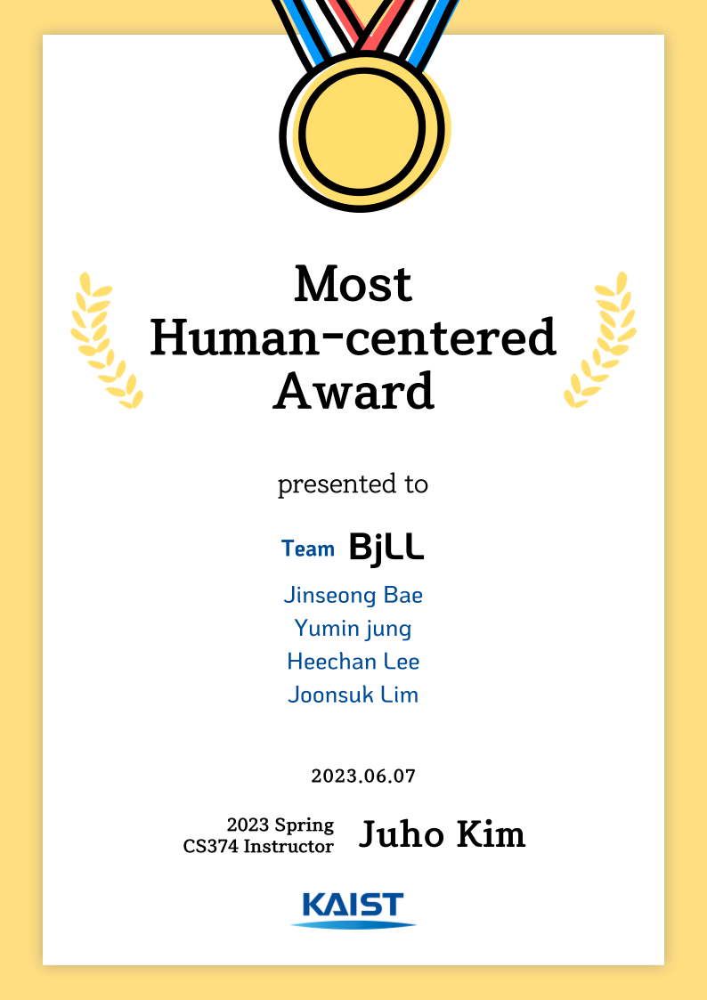

## CS374: Introduction to Human-Computer Interaction

- Prototype Flow: [Link](https://www.figma.com/proto/J9SO2BvY2B44PNgRjSt1wh/HCI-Team-BjLL?page-id=2006%3A40&type=design&node-id=2318-12138&viewport=17263%2C1160%2C0.6&scaling=min-zoom&starting-point-node-id=2318%3A17271&show-proto-sidebar=1&mode=design)
- Figma: [Link](https://www.figma.com/file/J9SO2BvY2B44PNgRjSt1wh/HCI-Team-BjLL?type=design&node-id=2318%3A17271&mode=design&t=K4JwS0EET1HxE6TQ-1)
- Video: [Link](https://youtu.be/YvoXL8Q2iKs)
- HW3 Code: [Link](https://github.com/yumin-jung/cs374-hw3)

